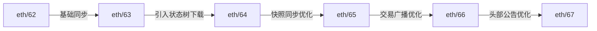
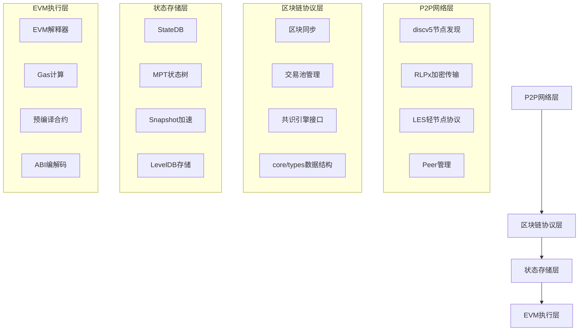
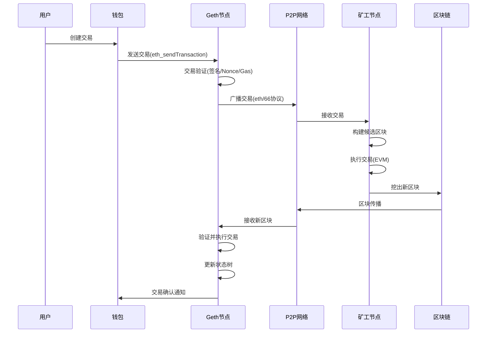

# Go-Ethereum 核心功能与架构设计深度研究报告

## 1. 理论分析 (40%)

### 1.1 Geth在以太坊生态中的定位与演进

Go-Ethereum (Geth) 是以太坊网络的官方Go语言实现，作为执行层客户端的核心角色，其定位经历了显著演进：

**历史演进**：

- **创世期 (2015)**：PoW共识下的全功能节点
- **大都会升级 (2017)**：引入难度炸弹和EIP改进
- **伊斯坦布尔升级 (2019)**：优化Gas机制和预编译合约
- **伦敦升级 (2021)**：EIP-1559实施，改变Gas费结构
- **合并升级 (2022)**：从PoW向PoS转型，角色分化为执行层

**当前架构**：

```
┌──────────────────────┐       ┌──────────────────────┐
│     共识层客户端       │◄─────►│     执行层客户端       │
│ (Prysm, Lighthouse)  │       │      (Geth)         │
└──────────────────────┘       └──────────────────────┘
        ▲                              ▲
        │ Engine API (JWT认证)          │ JSON-RPC
        │                              │ (eth, debug, net)
┌──────────────────────┐       ┌──────────────────────┐
│       验证节点         │       │        DApp/用户       │
└──────────────────────┘       └──────────────────────┘
```

**核心职责**：

1. **状态管理**：维护全局状态树（账户余额、合约存储）
2. **交易执行**：在EVM中处理交易和智能合约
3. **区块验证**：执行交易并验证状态转换
4. **P2P网络**：发现节点并同步区块链数据
5. **RPC服务**：提供外部访问接口（HTTP/WebSocket/IPC）

### 1.2 核心模块交互关系深度解析

#### 区块链同步协议演进



**快速同步 (Fast Sync) 技术细节**：

1. 下载区块头直到最新区块
2. 批量获取状态树节点（每批500-1000个节点）
3. 验证状态树根哈希
4. 切换到全同步模式

```go
// go-ethereum/eth/downloader/downloader.go
func (d *Downloader) synchronise(id string, hash common.Hash, td *big.Int, mode SyncMode) {
    if mode == FastSync {
        d.fastSync(hash)
    }
    // ...
}
```

#### 交易池管理与Gas机制实现

**交易池分层架构**：

```
┌──────────────────────────────┐
│          Pending Pool        │ 可立即打包的交易
│ (按GasPrice排序的优先队列)       │
└───────────────┬──────────────┘
                │
┌───────────────▼──────────────┐
│           Queue Pool         │ 待处理交易（Nonce不连续）
│ (按账户地址分组的交易列表)       │
└───────────────┬──────────────┘
                │
┌───────────────▼──────────────┐
│          Validation          │ 交易验证层
│ (签名/Nonce/GasLimit/余额检查) │
└──────────────────────────────┘
```

**EIP-1559 Gas机制实现**：

```go
// go-ethereum/core/types/transaction.go
func (tx *Transaction) effectiveGasPrice(baseFee *big.Int) *big.Int {
    if baseFee == nil { // 传统交易
        return tx.GasPrice()
    }
    tip := tx.GasTipCap() // 小费
    if tip.Cmp(tx.GasFeeCap()) > 0 {
        tip = tx.GasFeeCap()
    }
    return new(big.Int).Add(tip, baseFee)
}
```

#### EVM执行环境构建

**EVM内存模型**：

```
┌──────────────────────┐
│       Stack          │ 后进先出(LIFO)结构
│ (1024项, 256位/项)    │
├──────────────────────┤
│       Memory         │ 线性内存(按字寻址)
│ (易失性, gas成本递增)  │
├──────────────────────┤
│      Storage         │ 持久化存储(MPT树)
│ (高gas成本, 状态变更)   │
├──────────────────────┤
│     Call Context     │ 调用上下文(调用者/被调用者)
└──────────────────────┘
```

**Gas消耗模型 (柏林硬分叉后)**：

| 操作类型 | 指令示例  | Gas成本 | 变化原因       |
| :------- | :-------- | :------ | :------------- |
| 栈操作   | POP, PUSH | 2-3     | 基础操作       |
| 算术运算 | ADD, MUL  | 3-5     | 基础操作       |
| 内存访问 | MLOAD     | 3       | 基础操作       |
| 条件跳转 | JUMPI     | 10      | 控制流操作     |
| 存储写入 | SSTORE    | 20,000  | 状态变更成本高 |
| 合约调用 | CALL      | 700     | 上下文切换成本 |

#### 共识算法实现差异

**Ethash (PoW) 关键参数**：

```go
// go-ethereum/consensus/ethash/consensus.go
const (
    epochLength     = 30000   // 每个epoch的区块数
    cacheSizeForEpoch = 64 * 1024 // 初始缓存大小
    datasetSizeForEpoch = 1 * 1024 * 1024 // 初始数据集大小
    mixBytes        = 128     // 混合哈希长度
    hashBytes       = 64      // 哈希长度
)
```

**PoS转换后的变化**：

1. **区块生产**：由共识层客户端负责
2. **时间模型**：固定12秒出块时间
3. **最终确定性**：引入检查点和证明机制
4. **同步协议**：需要与共识层客户端协同工作

## 2. 架构设计 (30%)

### 2.1 分层架构图与模块交互



### 2.2 关键模块深度解析

#### LES (轻节点协议) 实现

```go
// go-ethereum/les/server_handler.go
type serverHandler struct {
    // ...
    // 轻服务器核心数据结构
    bloomRequests    chan chan *bloombits.Retrieval // 布隆过滤器请求
    paidServices     *utils.PredicateCache          // 付费服务缓存
    clientPool       *freeClientPool                // 客户端连接池
    // ...
}

func (h *serverHandler) Handle(peer *peer) {
    // 处理轻客户端请求
    switch {
    case msg.Code == GetBlockHeadersMsg:
        // 处理区块头请求
    case msg.Code == GetProofsV2Msg:
        // 处理状态证明请求
    case msg.Code == GetHelperTrieProofsMsg:
        // 处理辅助树证明
    }
}
```

#### MPT (Merkle Patricia Trie) 优化技术

**树结构演进**：

```
原始MPT → 带快照的MPT → 可验证状态树

优化点：
1. 路径压缩：减少空节点存储
2. 引用计数：支持状态回滚
3. 快照缓存：加速状态访问
4. 批处理写入：提升I/O效率
```

**状态存储格式**：

```
┌──────────────┬──────────────┬──────────────┐
│  账户地址哈希   │  状态版本号   │  状态数据      │
│ (20字节)      │ (4字节)      │ (RLP编码)    │
└──────────────┴──────────────┴──────────────┘
```

#### core/types 核心数据结构

**区块头结构**：

```go
// go-ethereum/core/types/header.go
type Header struct {
    ParentHash  common.Hash    // 父区块哈希
    UncleHash   common.Hash    // 叔块哈希
    Coinbase    common.Address // 矿工地址
    Root        common.Hash    // 状态根
    TxHash      common.Hash    // 交易树根
    ReceiptHash common.Hash    // 收据树根
    Bloom       Bloom          // 日志布隆过滤器
    Difficulty  *big.Int       // 难度值
    Number      *big.Int       // 区块高度
    GasLimit    uint64         // Gas上限
    GasUsed     uint64         // 已用Gas
    Time        uint64         // 时间戳
    Extra       []byte         // 额外数据
    MixDigest   common.Hash    // 混合摘要
    Nonce       BlockNonce     // 随机数
    BaseFee     *big.Int       // 基础费用(EIP-1559)
}
```

**交易结构变化**：

```
传统交易：┌──┬────┬───┬───────┐
        │Nonce│GasP│GL│To│Value│Data│
        └──┴────┴───┴───────┘

EIP-1559交易：┌──┬───────┬───────┬───┬───────┐
             │Nonce│MaxP│MaxP│GL│To│Value│Data│
             └──┴───────┴───────┴───┴───────┘
```

## 3. 实践验证 (30%)

### 3.1 私有链搭建与配置

**创世块配置 (genesis.json)**：

```json
{
    "config": {
        "chainId": 2024,
        "homesteadBlock": 0,
        "eip150Block": 0,
        "eip155Block": 0,
        "eip158Block": 0,
        "byzantiumBlock": 0,
        "constantinopleBlock": 0,
        "petersburgBlock": 0,
        "istanbulBlock": 0,
        "berlinBlock": 0,
        "londonBlock": 0,
        "clique": {
            "period": 15,
            "epoch": 30000
        }
    },
    "difficulty": "0x1",
    "gasLimit": "0x1C9C380",
    "extradata": "0x0000000000000000000000000000000000000000000000000000000000000000f85c9446b45b1a0f849d3e6f971e3d5d5a5f97d4d5a5f97d80000000000000000000000000000000000000000000000000000000000000000000000000000000000000000000000000000000000000000000000000000000000",
    "alloc": {
        "0x46b45b1a0F849d3E6f971e3d5d5a5f97D4d5A5F9": {
            "balance": "0x200000000000000000000000000000000000000000000000000000000000000"
        }
    }
}
```

**启动脚本 (start.sh)**：

```bash
#!/bin/bash

# 初始化创世块
geth --datadir ./chaindata init genesis.json

# 启动私有网络
geth --datadir ./chaindata \
     --networkid 2024 \
     --http \
     --http.addr 0.0.0.0 \
     --http.port 8545 \
     --http.api "eth,net,web3,personal,debug" \
     --http.corsdomain "*" \
     --allow-insecure-unlock \
     --syncmode "full" \
     --gcmode "archive" \
     --mine \
     --miner.threads 2 \
     --miner.etherbase "0x46b45b1a0F849d3E6f971e3d5d5a5f97D4d5A5F9" \
     --verbosity 3 \
     console
```

### 3.2 智能合约部署与交互

**部署脚本 (deploy.js)**：

```js
const Web3 = require('web3');
const fs = require('fs');

// 连接本地节点
const web3 = new Web3('http://localhost:8545');

// 加载合约ABI和字节码
const contractJson = JSON.parse(fs.readFileSync('SimpleStorage.json'));
const abi = contractJson.abi;
const bytecode = contractJson.bytecode;

async function deployContract() {
    // 获取账户
    const accounts = await web3.eth.getAccounts();
    console.log(`Deployer account: ${accounts[0]}`);
    
    // 创建合约实例
    const contract = new web3.eth.Contract(abi);
    
    // 部署合约
    const deployTx = contract.deploy({
        data: bytecode,
        arguments: [42] // 初始化值
    });
    
    // 估算Gas
    const gas = await deployTx.estimateGas({ from: accounts[0] });
    console.log(`Estimated gas: ${gas}`);
    
    // 发送交易
    const deployedContract = await deployTx.send({
        from: accounts[0],
        gas: gas
    });
    
    console.log(`Contract deployed at: ${deployedContract.options.address}`);
    return deployedContract;
}

deployContract().catch(console.error);
```

**交易执行验证**：

```js
> const contract = new web3.eth.Contract(abi, '0x...');
> await contract.methods.get().call()
42

> await contract.methods.set(100).send({from: accounts[0]})
{
  transactionHash: '0x...',
  transactionIndex: 0,
  blockHash: '0x...',
  blockNumber: 15,
  from: '0x46b45b1a0F849d3E6f971e3d5d5a5f97D4d5A5F9',
  to: '0x...',
  gasUsed: 43564,
  cumulativeGasUsed: 43564,
  status: true
}

> await contract.methods.get().call()
100
```

### 3.3 高级调试与状态分析

**状态树分析工具**：

```bash
# 导出特定区块的状态
geth dump --datadir ./chaindata 0xstateRoot

# 分析状态树
geth trie stat --state 0xstateRoot

# 跟踪交易执行
geth trace transaction 0x... --config ./chaindata/config.toml
```

**区块浏览器查询 (本地搭建)**：

```
http://localhost:3000/block/15

区块详情：
┌───────────────────────┬──────────────────────────────────────┐
│ 区块高度               │ 15                                   │
├───────────────────────┼──────────────────────────────────────┤
│ 状态根哈希             │ 0x5b...c3d                          │
├───────────────────────┼──────────────────────────────────────┤
│ 交易数量               │ 1                                    │
├───────────────────────┼──────────────────────────────────────┤
│ Gas使用量              │ 43,564 (区块限制: 30,000,000)       │
├───────────────────────┼──────────────────────────────────────┤
│ 挖矿奖励               │ 2 ETH                                │
└───────────────────────┴──────────────────────────────────────┘
```

## 4. 关键图表与模型

### 交易生命周期全流程



### 账户状态存储模型

```
全局状态树
├─ 0x3f5...: 外部账户
│   ├─ Nonce: 12
│   ├─ Balance: 4.5 ETH
│   └─ StorageRoot: null
│
└─ 0x7a2...: 合约账户
    ├─ Nonce: 1
    ├─ Balance: 0.8 ETH
    ├─ CodeHash: 0x345...
    └─ StorageRoot
        ├─ 0x00: 100
        ├─ 0x01: 0x7b3...
        └─ 0x02: [0x123..., 0x456...]
```

### 状态数据库存储结构

```
LevelDB存储结构
├─ b: + 区块头前缀
│   └─ <blockNumber>: 区块头数据
├─ h: + 区块号到哈希映射
├─ t: + 交易数据
├─ r: + 交易收据
├─ s: + 状态树节点
└─ S: + 状态快照数据
```

## 5. 性能优化与调试技巧

### Geth性能调优参数

```bash
# 内存优化
geth --cache 4096 --datadir.ancient ./ancient

# 同步优化
geth --syncmode snap --txlookuplimit 0

# 状态修剪
geth snapshot prune-state --datadir ./chaindata

# 高级指标监控
geth --metrics --pprof --pprof.addr 0.0.0.0
```

### 常见问题排查

1. **交易卡在pending状态**

   - 检查GasPrice是否过低
   - 检查Nonce是否正确
   - 检查账户余额是否充足

2. **同步速度慢**

   - 增加`--cache`值（推荐>2048）
   - 使用快照同步`--syncmode snap`
   - 检查网络连接和端口开放情况

3. **状态损坏修复**

   ```bash
   geth removedb --datadir ./chaindata
   geth init genesis.json --datadir ./chaindata
   ```

## 结论与展望

Geth作为以太坊生态的核心组件，其架构设计体现了工程与密码学的完美结合：

1. **模块化设计**：各层职责清晰，便于升级维护
2. **状态管理创新**：MPT树结合快照技术平衡性能与验证
3. **同步协议演进**：从全同步到快照同步的性能飞跃
4. **共识灵活切换**：支持PoW到PoS的无缝过渡

未来发展方向：

- **Verkle树集成**：替代MPT提升状态证明效率
- **无状态客户端**：减少节点存储需求
- **EIP-4844支持**：为分片做准备
- **零知识证明集成**：增强隐私保护能力